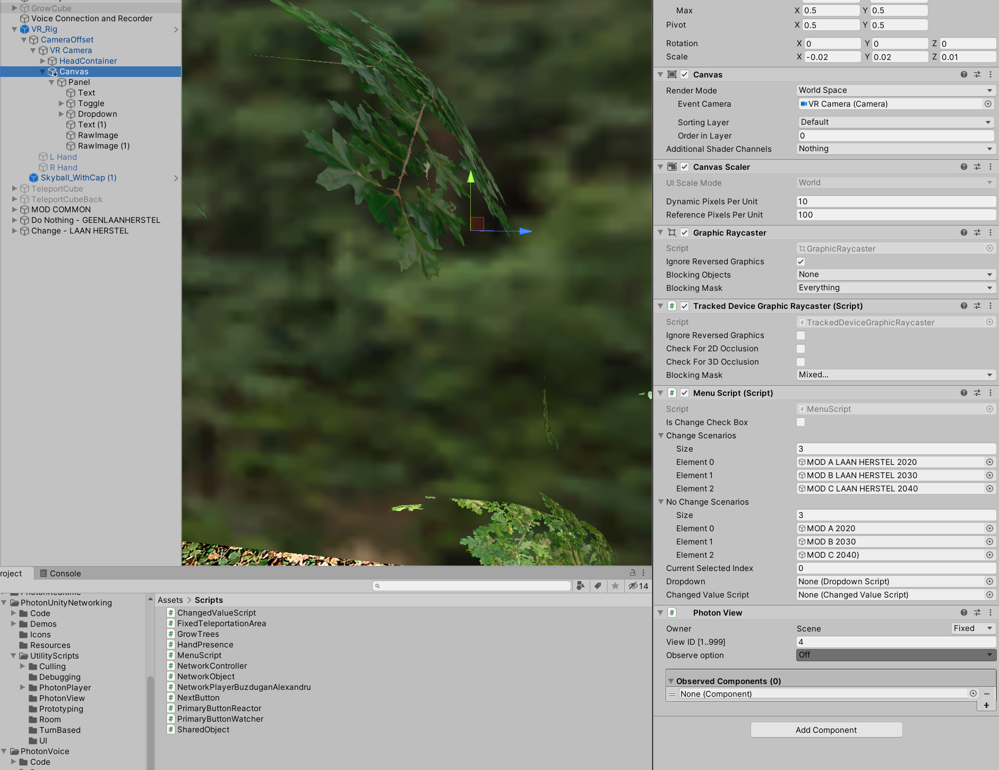

# Multiroam-VR ocumentation

## Description

The purpose of the created project is to enable multiple creative people to join and share diferrent ideas about different perspectives of the nature. The main user should be able to present to a group of people how an large landscape looks like, and how it could look like in the future by showcasing the growth of the trees.

From a techincal point of view the project offers the following functionalities :
- Oculus quest hand traking
- Network capabilities to see multiple players in the same room
- Shared player hands between multiple players
- Network capabilities to share the objects with other in the same room
- Teleportation in a vast landscape
- UI Selection using the oculus controllers

## Unity settings 

For this project we are using Unity 2019.4.01f.
The project has the following packages installed 

```json
{
  "dependencies": {
    "com.unity.collab-proxy": "1.2.16",
    "com.unity.ide.rider": "1.1.4",
    "com.unity.ide.vscode": "1.2.0",
    "com.unity.quicksearch": "1.6.0-preview.6",
    "com.unity.test-framework": "1.1.14",
    "com.unity.textmeshpro": "2.0.1",
    "com.unity.timeline": "1.2.12",
    "com.unity.ugui": "1.0.0",
    "com.unity.xr.interaction.toolkit": "0.9.4-preview",
    "com.unity.xr.management": "3.2.10",
    "com.unity.xr.oculus": "1.3.4",
    "com.unity.modules.ai": "1.0.0",
    "com.unity.modules.androidjni": "1.0.0",
    "com.unity.modules.animation": "1.0.0",
    "com.unity.modules.assetbundle": "1.0.0",
    "com.unity.modules.audio": "1.0.0",
    "com.unity.modules.cloth": "1.0.0",
    "com.unity.modules.director": "1.0.0",
    "com.unity.modules.imageconversion": "1.0.0",
    "com.unity.modules.imgui": "1.0.0",
    "com.unity.modules.jsonserialize": "1.0.0",
    "com.unity.modules.particlesystem": "1.0.0",
    "com.unity.modules.physics": "1.0.0",
    "com.unity.modules.physics2d": "1.0.0",
    "com.unity.modules.screencapture": "1.0.0",
    "com.unity.modules.terrain": "1.0.0",
    "com.unity.modules.terrainphysics": "1.0.0",
    "com.unity.modules.tilemap": "1.0.0",
    "com.unity.modules.ui": "1.0.0",
    "com.unity.modules.uielements": "1.0.0",
    "com.unity.modules.umbra": "1.0.0",
    "com.unity.modules.unityanalytics": "1.0.0",
    "com.unity.modules.unitywebrequest": "1.0.0",
    "com.unity.modules.unitywebrequestassetbundle": "1.0.0",
    "com.unity.modules.unitywebrequestaudio": "1.0.0",
    "com.unity.modules.unitywebrequesttexture": "1.0.0",
    "com.unity.modules.unitywebrequestwww": "1.0.0",
    "com.unity.modules.vehicles": "1.0.0",
    "com.unity.modules.video": "1.0.0",
    "com.unity.modules.vr": "1.0.0",
    "com.unity.modules.wind": "1.0.0",
    "com.unity.modules.xr": "1.0.0"
  }
}
```
The project is using using Unity's XR plug-in Management system that allows for easier usage of the oculus device sdk and oculus quest device.


Once you open the project please make sure the everything is working properly and you don't receive any warning messages. The project is using Photon networking system (https://www.photonengine.com/en-US/Photon) to enable network communication


Photon has a wizard in unity that we can use to set the connection string for our network. 
Go to Window -> Photon Unity Network -> Highlight Server Settings (you should see the Photon Server Settings)


Make sure you have an App Id Set. 

Photon allows users to create applications on their site that act like an environment that players use to connect to. This environment has an unique identification.
If you want to work on this make sure that locally you create a new Photon PUN application on the photon website, and use that app id. 


If you want to have multiple people connecting on the application then make sure eveybody working with this has the same App Id. 
When you build and create the executable/apk that one has the AppId you set in unity so when people will be using the exe/apk they will all connect to the same place.

You can see the trafic and how many people connect to the same application in photon dashboard.

By Default the application should come with the settings presented in the documentation.

## Project Structure

The project structure is quite simple. The project is comprise of 2 scenes:
1. LevelSelection scene (This scene is used as a starting place each player sees when the application starts. After a players clicks on connect the KoningswegN310 scene loads)

2. KoningswegN310 scene (This scene is used as the playground where players can connect and see each other.)


In the main scene the folder structure looks like this

Most of the folders are just assets that are imported using unity asset manage:
- _TerrainAutoUpgrade (something Unity generates when working with the terrain tool)
- Ciconia Studio (graphical assets)
- Editor (Unity folder)
- FBX (models and graphical objects)
- Obj (not important)
- Oculus (Oculus sdk from the Unity asset store)
- Oculus Hands (Oculus hands assets)
- Photon (Photon library from asset store for networking)
- Prefabs (for our prefabs)
- Scenes (contaning the scenes)
- Scripts (where our code is)
- SkySphere_V1 (an sky sphere asset from the asset store)
- Sounds (folder containing sounds for the application)
- XR (XR package, unity asset for interacting with an XR device)

We make changes mostly to the scripts when we write our code, and in photon to add the prefabs used for instantiation on players devices.

The scene structure is also quite simple. The most important components are as follows:
- Voice Connection and Recorder
- VR_Rig
- The Ui Canvas
- The Controller button watcher

Lets go through each one and explain how each one work to make this possible.

Lets start firs with the VR_RIG.

## Unity XR Integration toolkit

We have our VR device ready and plugged in the computer, but we need some code that knows to use the device API. Fortunately we don't have to write that code. The guys from Oculus provide a library written in C# that offers multiple scripts that allow us to interact with the device. Even better than that the guys from Unity offer the same too but more generic, so it supports 
different devices than oculus (vive, etc).

(https://www.youtube.com/watch?v=ndwJHpxd9Mo&ab_channel=VRwithAndrew)

The xr integration toolkit offers an prefab called an VR_RIG which is basically the object that acts like the player in the VR world. This object is comprise from the following:


The Vr_Rig object has an:
- XRRig (script used for saying this will be the device of the player)
- Locomotion System (used for teleportation)
- Snap Turn Provider (for allowing to turn to 45 degrees left or right)
- Character Controller (for allowing the movemeng (is not really necessary))


There is also a Canvas under the camera, this canvas is used for displaying the menu with the options to select for the growth of the trees.
There is a custom script here called MenuScript that allows for registering a structure with multiple options possibilities for the scenarios. In our case we have the case where the new trees are planted and for that we want to have the change scenarios list populated and the scenarios where the trees are left where we want to have the NoChange scenarios populated. This script is more of a placeholder used to hold data that will be used by the ui. 




Besides the object where the camera is the VR_Rig has also the hands.


The hands objects contain the following:
- XR Controller (this is the script that has the controller functionality and can be used for right or left)
- XR Ray interactor (This is the script used for using a ray that allows for interacting with objects)
- XR Interactor Line Visual (This is the script used for drawing the pointer line on the screen)
- Primary Button Watcher and reactor (Custom scripts that create an button pressed event to attach to the controller press button event and perform and action like opening the ui menu)


That is preety much what is on the VR_Rig, one last important detail is that the objects that control the hands have some hand models under them. This hand models will be enabled through the network so the other players will see them but this has to be explained in how photon works here.

## Photon communication

Photon networking has 1 really important object in this scene, the __Voice Connection and Recorder__ object.


This object has 2 important components:
- Voice Connection
- Connect and Join Random Script

Photon works in the following way. Based on the application id when the application first starts a call is made to the photon server to register the current instance of the application so it can make calls to the photon server.
After the application is registered photon sends data back through events.
Photon is guiding the player in a manner such than first you are calling the ConnectNow method, then if everything is ok you get back an OnConnectedToMaster event, then you Try to join or create a room, if that is succesfull then OnJoinedRoom you can do stuff since you are connected and joined the same room as other players. In photon the room represents a place where players can join and interact in the same place.

Photon isn't so complicated, what is does basically it sends serialized information back and forth the players.

When thinking in networking for game we have to think that both players have the same application running but on different device. Both devices connect to the same place and can exchange information but the action and computation is done locally. 

In this case if i have oculus A and oculus B both start and load a scene where the ball is rolling, the ball will be rolling differently on both devices because of the device specs. But if we want to sincronize this then this means that we would have to have a leader, a player we want to syncronize data from and clients that will receive information from that player.

A similar approapch is with the players that are joining the room. Each player is running the application on his device, and has the vr rig attached to it's oculus.

In order for 2 players to see each other, when the players connect on the server and join the room then they have to send a signal to all other joined members that they connected and all the other players will instantiate and object locally that has the same position as the object of that player. In our case that is the head.


More can be explained regarding this subject but to keep it simple, in order to have objects sent through the network we have to Photon.Instantiate them, this will send a signal to other players to look locally on their machine for a prefab and instantiate it locally. Those prefabs have to have the Network Player script and the Photon View on them in order for photon to keep updating their position.


## To be added 

Video showcasing how everything works
